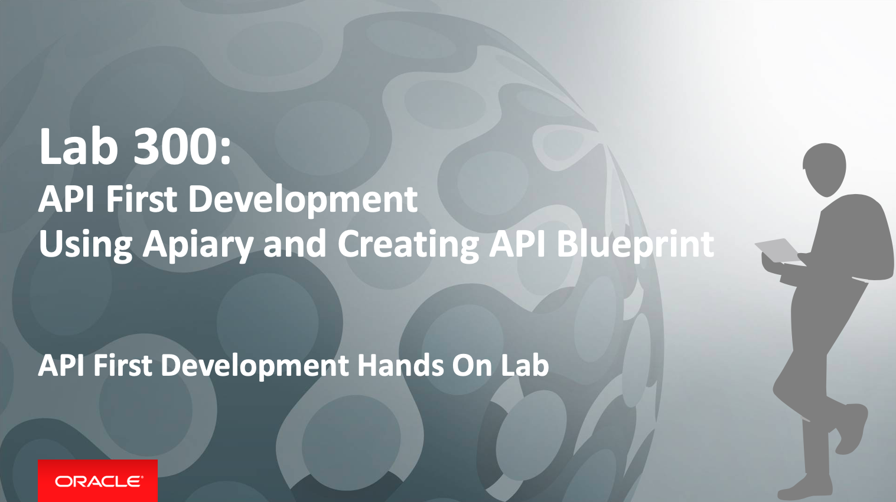
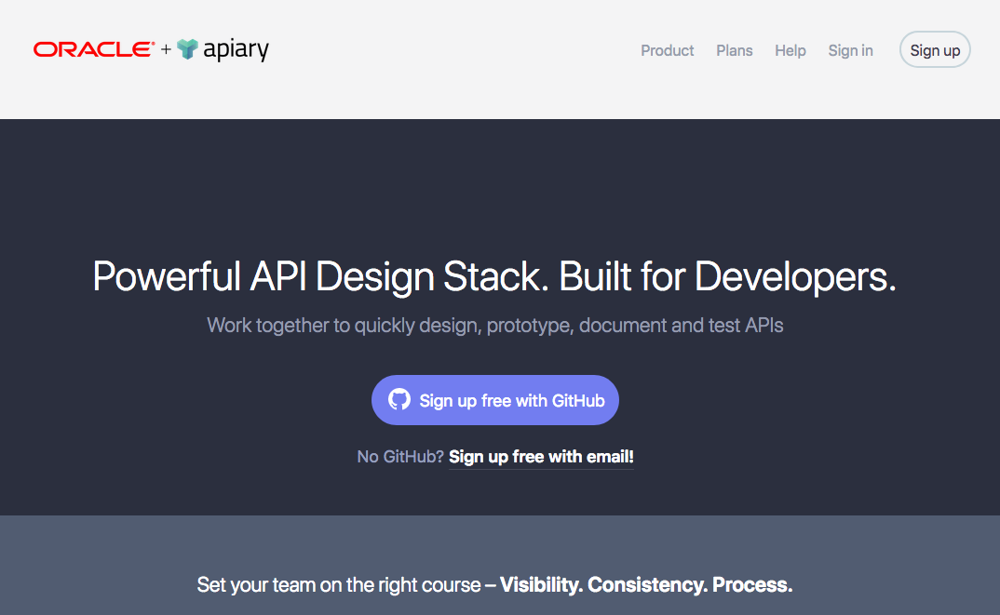
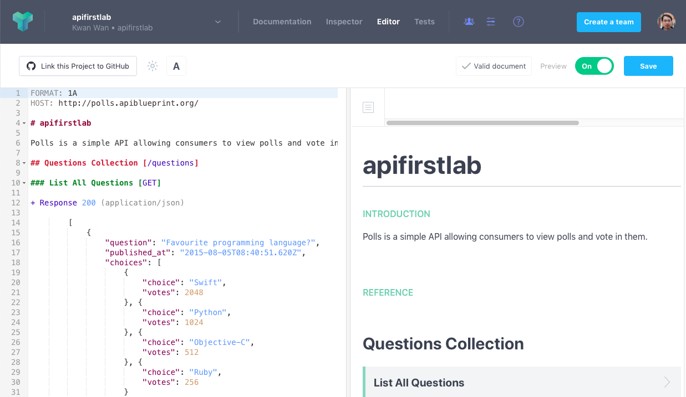
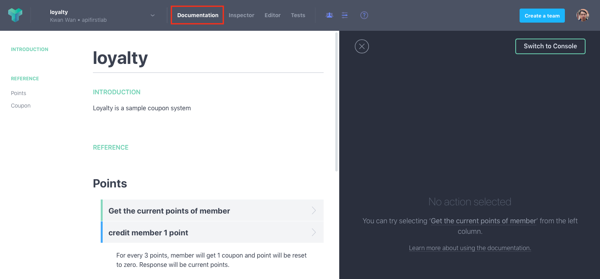
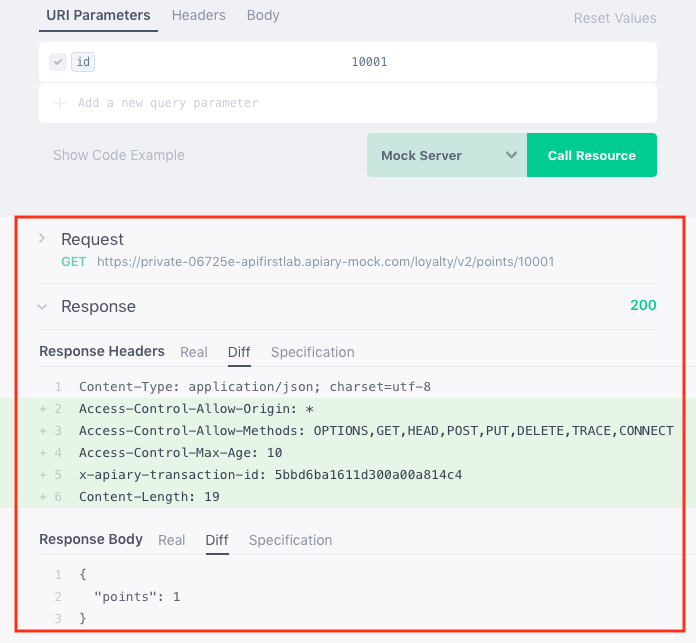
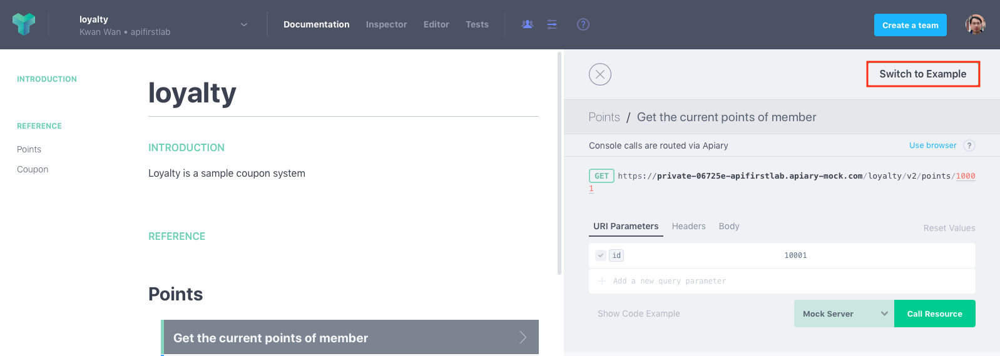
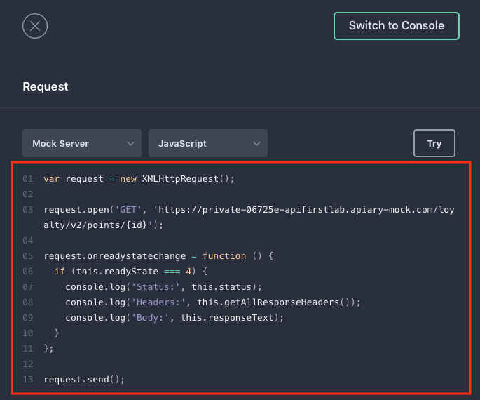

# Lab 300: Using Apiary and Create API Blueprint




API Blueprint is used to encourage dialogue and collaboration between project stakeholders, developers and customers at any point in the API lifecycle. At the same time, the API Blueprint tools provide the support to achieve the goals be it API development, governance or delivery.


### About This Exercise

In this exercise, we will:
- Use Apiary to write our Reward Service API called **loyalty**.
- Use the out of the box Apiary features to provide an API Mock for client application developer to test their client against an API Mock server.

For more detail information of apiary, please visit https://apiary.io

## Login to apiary.io

### Step 1: Navigate to apiary.io

- Open a browser window and navigate to https://apiary.io

  

### Step 2: Sign up a free account

- If you already have an Apiary account, you can just login. If you haven't, you can sign-up for a free account with either Github OR with email. **In this example, we will sign-up with email**.

- Click [ **Sign up free with email!** ]

- Fill in your name, your email address and desired password and click [ ** Sign up for Apiary** ] - *please remember to review Apiary's Terms of Service and Privacy Policy*.

  

- You will receive email verification for your Apiary account. Just follow the instructions in that email to activate your free account.

### Step 3: Login to Apiary and create our first API

- If you don't have an Apiary account, follow Step 2 to create one now. You can login to Apiary once you have created your own account and activated it.

- Login to Apiary if you haven't already.

  

- **IF THIS IS YOUR FIRST API, YOU WILL SEE A SCREEN LIKE THIS**. Provide a name for your API, e.g. **apifirstlab**.

  


- Leave the default setting for format to *Start your API in* **API Blueprint**

- Click [**SAVE AND START USING APIARY**]

- You will be taken to the API Editor as follow

  

- Your screen will be split in two halves. The left hand side is the API Editor and the right hand side is the preview of your API.

- A sample API is populated in the API Editor with the preview shown on the right hand side.


## Using Apiary Editor

### Step 4: Edit our API Blueprint

- We will now create the API Blueprint **loyalty** for our backend Reward Service. If you recall the Reward Service allows the client to query and update the reward points and coupons. These will be called through the **loyalty** API.

- In the API Editor, replace **EVERYTHING** (sample) with the following API documentation for **loyalty**.

- Take care when copying and pasting the text as the API Blueprint syntax is sensitive to spaces/tabs and line breaks. Please refer to the API Blueprint documentation and [tutorial](https://help.apiary.io/api_101/api_blueprint_tutorial/) for more details about how to write API Blueprint.


```
FORMAT: 1A
HOST: https://REPLACE-WITH-YOUR-ACCS-INSTANCE.oraclecloud.com

# loyalty

Loyalty is a sample coupon system

## Points [/loyalty/v2/points/{id}]

### Get the current points of member [GET]

+ Parameters
    + id: `10001` (string, required) ... member ID

+ Response 200
    + Headers

            Content-Type: application/json; charset=utf-8
    + Body

            {
                "points": 1
            }

### credit member 1 point [POST]

For every 3 points, member will get 1 coupon and point will be reset to zero. Response will be current points.

+ Parameters

    + id: `10001` (string, required) ... member ID

+ Request (application/json)

        {

        }

+ Response 200
    + Headers

            Content-Type: application/json; charset=utf-8
    + Body

            {
                "points": 2
            }

## Coupon [/loyalty/v2/coupon/{id}]

### Get the current coupon of member [GET]

+ Parameters
    + id: `10001` (string, required) ... member ID

+ Response 200
    + Headers

            Content-Type: application/json; charset=utf-8
    + Body

            {
                "coupon": 2
            }

### consume 1 coupon [POST]

+ Parameters
    + id: `10001` (string, required) ... member ID

+ Request (application/json)

        {

        }

+ Response 200
    + Headers

            Content-Type: application/json; charset=utf-8
    + Body

            {
                "coupon": 1
            }

```

- The final blueprint for **loyalty** will look similar to the following.

  

- Click **Save** to to save your API Blueprint.


## Using Apiary and Console

Once the API Blueprint is ready, we can use the Mock Server to test our API. We can also use the Mock Server for client application development & testing. The following steps shows how a Client Application Developer use Apiary to develop their client.


### Step 5: Exploring API Documentation

- Click the [**Documentation**] tab to navigate to the API documentation. This is the view which *Client Application Developers* will work in when they need to learn / check / test your APIs.

  


- Imagine you are the client application developer, when you navigate to this page, you can see this **loyalty** API contains:

  - Points
    - Get current points of member
    - Credit member 1 point
  - Coupon
    - Get current number of coupons of member
    - Consume 1 coupon


- Click [**Get the current points of member**] and check the right pane. It shows you an example of using this API and the endpoint (URL) of the Mock Server.

  


### Step 6: Testing with Mock Server

The Mock Server is automatically created each time you publish your API Description. This means the only thing you have to do to get started is to write your API Description, include specific requests and responses for your resources, and click publish.

There are several ways in which you may interact with the Mock Server, both using your own tools and environments and using Apiary’s console.

- Let's test the API with the Mock Server using the Apiary's console. On the right hand pane under the [**Request**] section, select [**Mock Server**] from the dropdown option list.

  

- After switching to the Mock Server, you will receive your own private URL for the Mock Server. This is to ensure that other users do not see the traffic you’re sending to the server. Take note of the URL.

- This URL may be used to interact directly with the server. You can make requests with applications like **curl** or **Paw** to that URL and will get responses defined in the API Description.

  

- Click [**Try**] button to switch to the console.

- The console is where you can send requests to the Mock Server directly from the documentation. Think of this as the test console.

- In this test console, you can set the desired URI parameters, headers, as well as entering your payload in the request body. Just keep the default values (*we are going to get the current point of member id 10001*).

  

- Check that we are using the [**Mock Server**]

- Click [**Call Resource**] button.

- Scroll down and you will see the API response *(from Mock Server)*. Feel free to explore the test console.

  


## Code Example for Client Application(s)

Apiary encourage a contract-first approach to designing your API. Write your API Description first before writing any server or client code.

To make this process possible, Apiary provides tools that allow you to try out your API as you design it as shown in Step 6.

Apiary provides code examples that you may use to interact with the Mock Server. Code examples are one tool provided that can be dropped into your existing code or used for prototyping. Apiary generates code samples in a variety of languages.


### Step 7: Get example code for different programming language(s)

- Go back to the example console by clicking the [**Switch to Example**] *(you might have to scroll to the top of the console pane)*.

  

- In the right hand pane, under the [Request] section, select your desired programming language from the dropdown option list. Select [**JavaScript**]

  

- After you selected a language, the sample code for that language will be displayed below. As you can see, if you want to develop a HTML5 application, you can just copy and paste this sample code segment to your JavaScripts source code and extend it. Feel free to try different languages.

  

- For example if you need to develop a NodeJS client, you can use the *request* npm module and have source code similar to the following segment to interact with the API service. Of course, these are just code examples. You can always use other framework (e.g. jquery, request-promise, etc) to integrate with the API service.

  

- You can also switch to other APIs by selecting an API choose from the *left hand pane*.


### Step 8: Apiary Mock Server

- Write down the URL of your Apiary Mock Server, we will need to use this URL in the next lab.

  

## You've complete the Using Apiary & API Blueprint Lab.

Proceed to Next lab

Go Back to the Main Page

---
---
### Extra Screen Shot

- **IF YOU ALREADY HAVE OTHER API(s), YOU WILL SEE A SCREEN LIKE THIS**. You can choose [**Create New API Project**] in the pull-down menu and provide required information, i.e. name of API, e.g. **loyalty**. Remember to choose *Start your API in* **API Blueprint**.


