# ORACLE Cloud Test Drive #
-----
## Installation of Git Client ##

Git is a version control system for tracking changes in computer files and coordinating work on those files among multiple people. It is primarily used for source code management in software development,[8] but it can be used to keep track of changes in any set of files.

#### Installation of Git Client ####

1. Double click the Git client you've downloaded or copied from the instructor

2. Click [Yes] to proceed to install

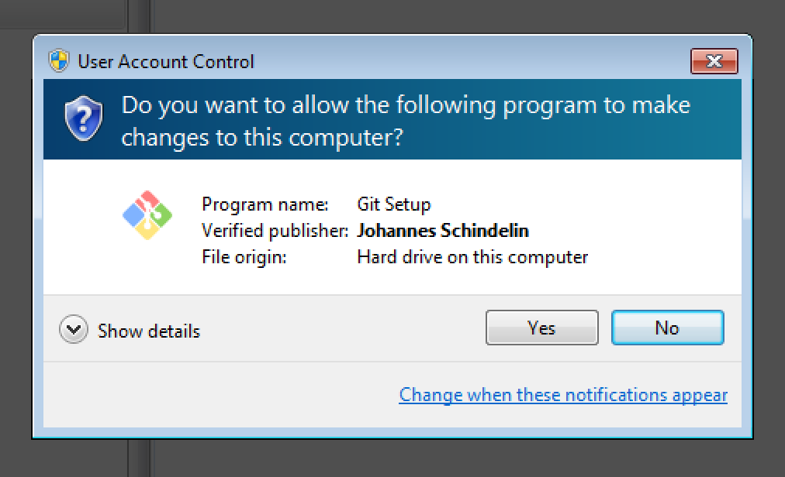

3. Click [Next] to accept the license

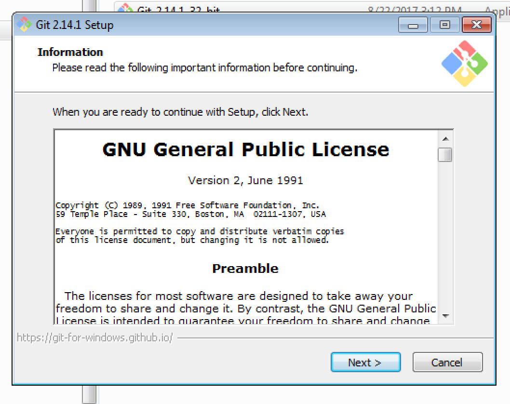

4. Provide the destination folder for the installation - **default is recommended** and click [Next]

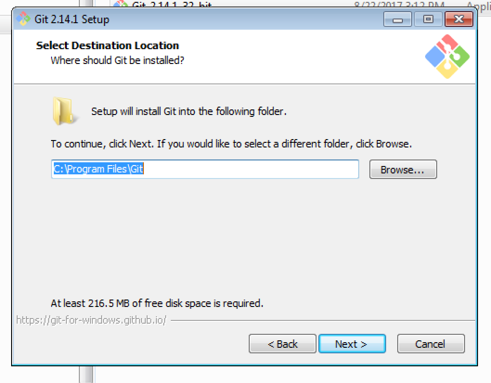

5. You can select the components to be installed - just keep **default** and click [Next]

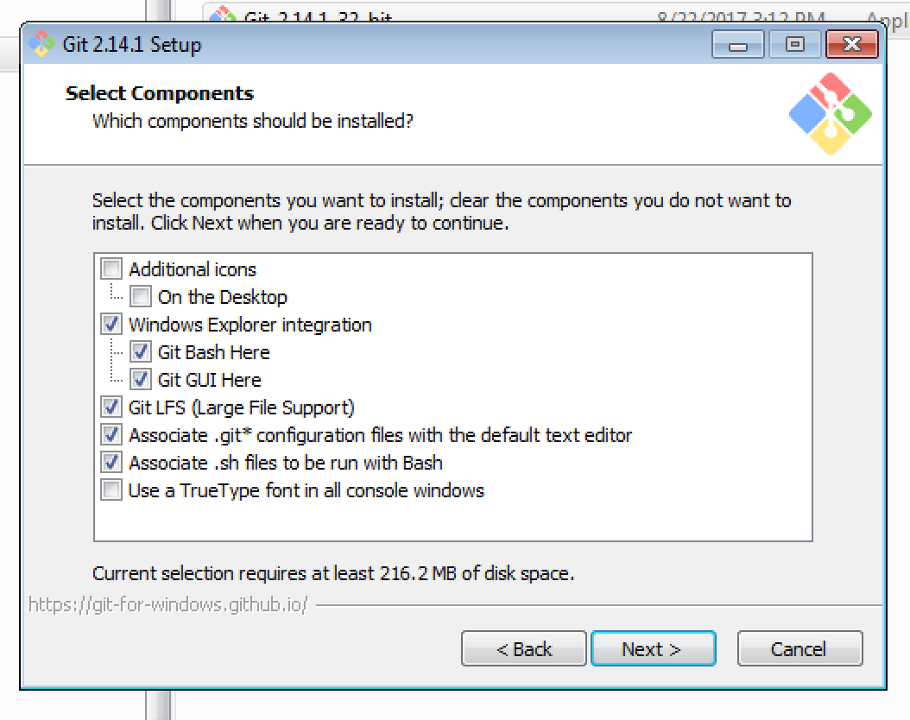

6. You can provide a Start Menu folder name - just keep **default** and lick [Next]

7. Select **Use Git from the Windows Command Prompt** and click [Next]

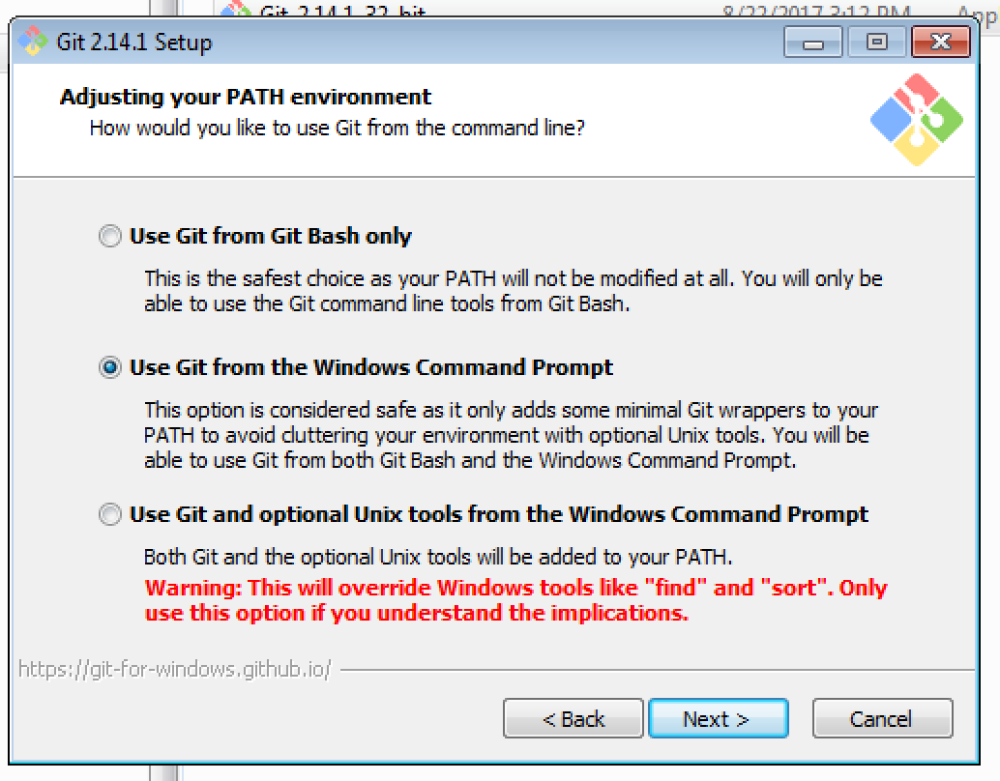

8. Select the desired SSL library - keep **default** and click [Next]

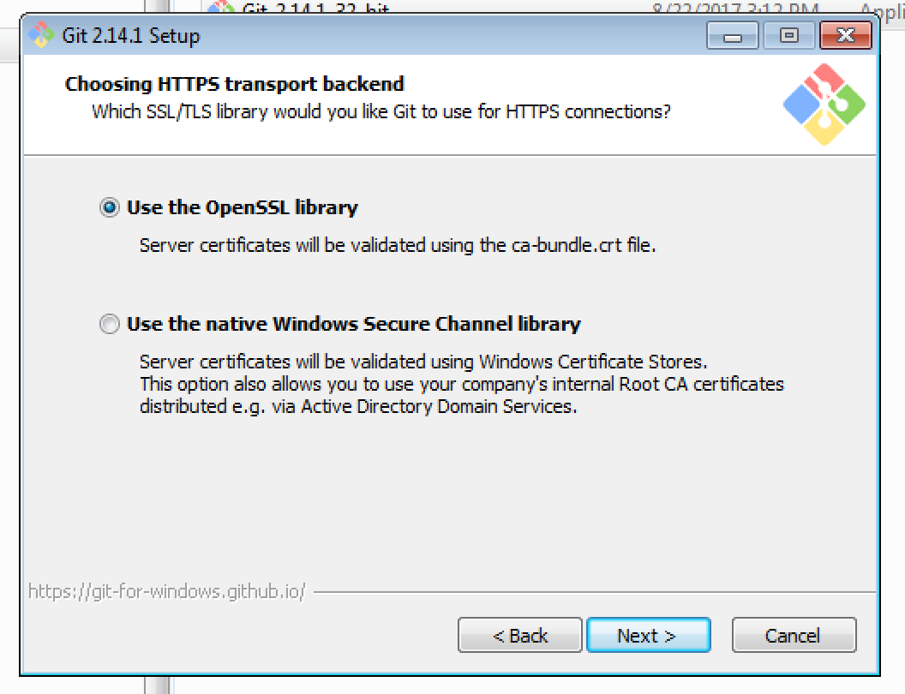

9. Keep **default** for the CRLF style and click [Next]

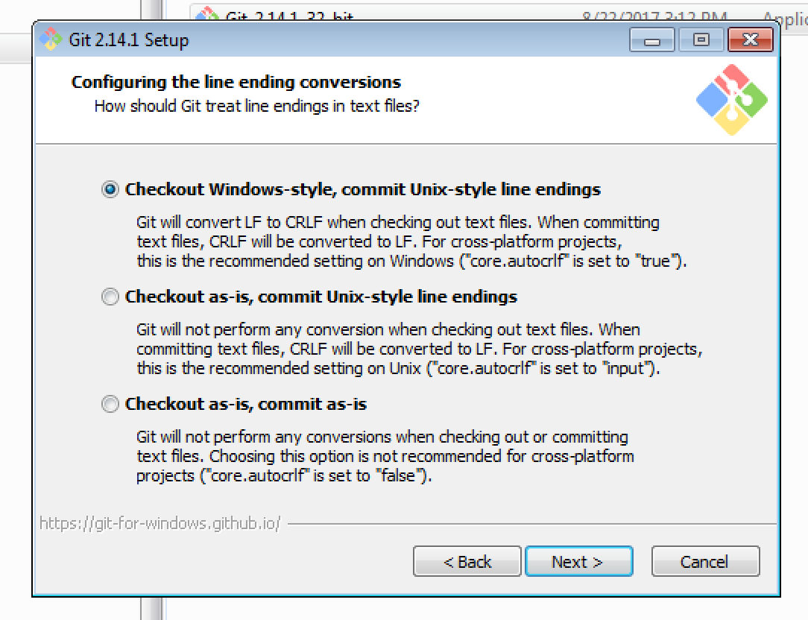

10. Keep **default** for terminal emulator and click [Next]

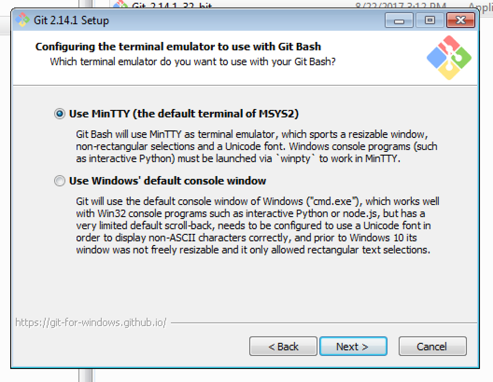

11. Keep **default** for extra options and click [Install]

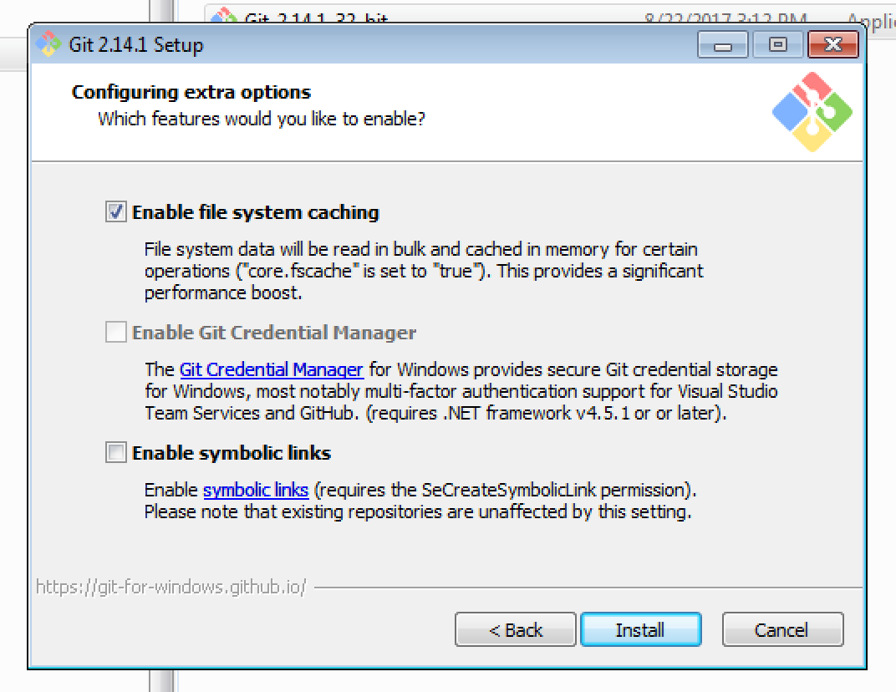

12. Wait for the installation to finish

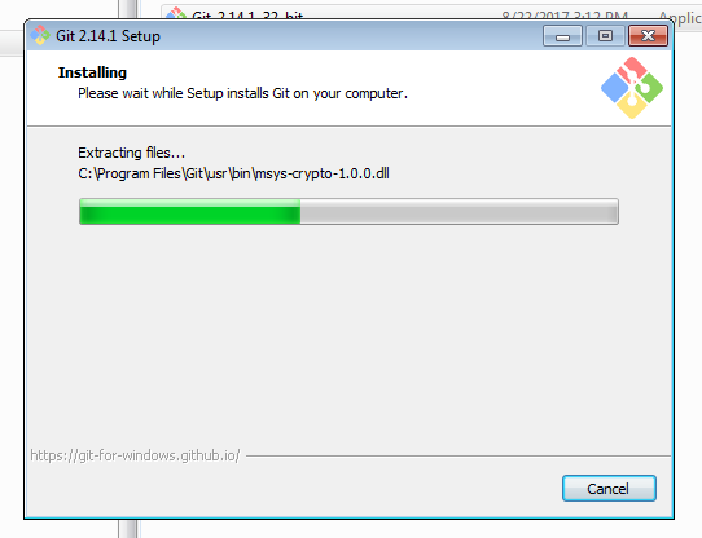

13. Click [Finish] when done

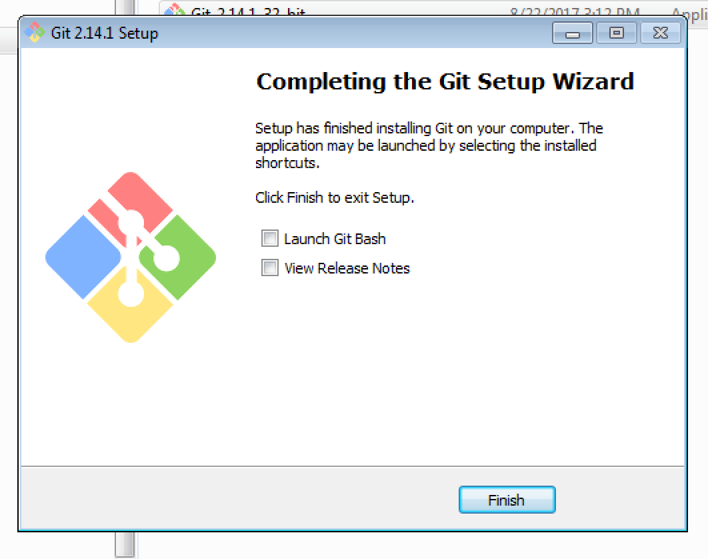

[Back to CI/CD Lab](CICDlab.md)

or

[Back to Cafe Supremo Home](README.md)
